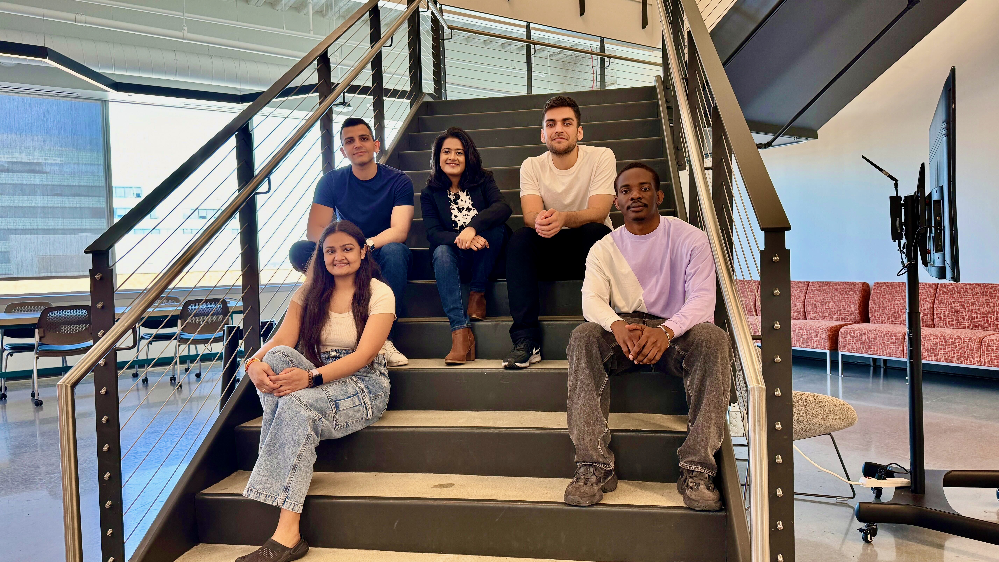

### Welcome!

  
  
Group Photo: FSE Conference 2024 - San Francisco, CA

Welcome to the SOAR (Software Engineering and Analytics Research) Lab. SOAR Lab is a software engineering research group in the Department of Computer Science at Drexel University led by [Dr. Preetha Chatterjee](https://preethac.github.io/). At SOAR, our focus is on improving software engineers’ tools and environments through empirical data analysis, natural language processing and machine learning.

### About PI

Preetha Chatterjee is an Assistant Professor in the [Department of Computer Science](https://drexel.edu/cci/academics/computer-science-department/) at [Drexel University](https://drexel.edu/). Her research interests are primarily in software engineering, with the goal of improving software engineers’ tools and environments through different techniques such as data mining, text analysis, and machine learning. She is especially interested in mining software repositories at a large scale and extending data analytics solutions to transform the plethora of information available in software artifacts into actionable nuggets of knowledge and tools, which is useful for both software engineers and researchers. Through her research, she intends to enable advances in areas including building/enhancing recommender systems for developers, information retrieval tasks from unstructured developer communications, and understanding social and human aspects in software engineering.

